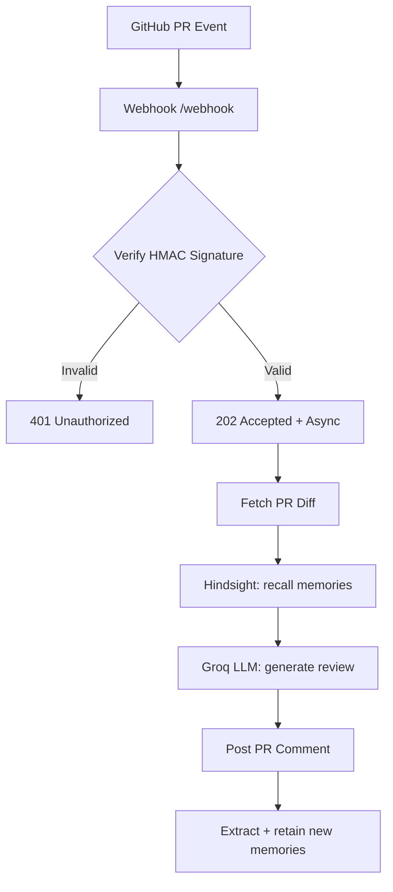

# Code Review Agent with Hindsight Memory

An AI code review agent that remembers your team's decisions, conventions, and past incidents — and gets smarter with every PR.

**Hackathon:** HackwithHyderabad 3.0

## Why Memory Matters
Without memory, an AI reviewer is a generic linter. With [Hindsight](https://github.com/vectorize-io/hindsight), it becomes a long-term team contributor that recalls decisions made weeks ago and flags violations with citations.

## How It Works
1. GitHub sends a `pull_request` webhook (opened/synchronize/reopened/ready_for_review; drafts are skipped until marked ready) to `POST /webhook`
2. Signature verified (HMAC-SHA256, timing-safe) on the **raw** body
3. Repo allowlist check (if `GITHUB_REPO_OWNER` + `GITHUB_REPO_NAME` are both set, other repos are rejected)
4. PR diff fetched from the GitHub API (oversized diffs are truncated with an explicit marker so the model states it reviewed only part of the change)
4. Relevant team decisions recalled from Hindsight (query = title + changed files + diff excerpt)
5. Groq LLM generates a review with memories injected — citing decisions like "per convention [2]"
6. Review posted as a PR comment
7. New learnings extracted from the review and retained back into Hindsight



## Run Locally (Development)

```bash
cp .env.example .env    # fill in real keys
npm install
npm run seed            # optional: seed team conventions
npm run dev             # starts on :8080
```

Forward GitHub webhooks locally (no public URL needed):

```bash
gh extension install cli/gh-webhook
gh webhook forward --repo your-username/code-review-agent --events pull_request > /dev/null
```

---

# Deploying to Production — Webhook Mode (Recommended)

The agent is designed to run as an always-on webhook service: deploy it once, and every PR on your repository gets reviewed automatically in real time. One deployment can serve any repo you point at it.

There are two hosting approaches:

| Approach | Best when | Cost |
|---|---|---|
| **A. Managed platform (Render)** — recommended | You want it working in ~10 minutes, no servers | Free tier available |
| **B. Your own VPS with Docker** | You already run servers / want full control | Your VPS |

Follow **one** of A or B below, then continue with **Step 4** (configure the GitHub webhook).

## Step 0 — Prerequisites (5 min)

You need three things before deploying:

1. **A GitHub token**
   - Easiest: classic PAT with the `repo` scope (`github.com → Settings → Developer settings → Personal access tokens → Tokens (classic)`)
   - Tighter (recommended): fine-grained PAT limited to your repo(s) with permissions:
     - **Pull requests: Read-only** (to fetch the diff)
     - **Issues: Read and write** (to post the review comment)
2. **A Groq API key** — from `console.groq.com → API Keys`
3. **A Hindsight API key** — from the Vectorize Hindsight cloud (or run the optional self-hosted container from `docker-compose.yml`, Step 3B)

## Step 1 — Generate a webhook secret

Run this anywhere Node is installed and keep the output:

```bash
node -e "console.log(require('node:crypto').randomBytes(32).toString('hex'))"
```

This single string must be set in **two places** (your deployment env var `GITHUB_WEBHOOK_SECRET` and the GitHub webhook settings). If they ever disagree, every delivery returns 401.

## Step 2 — Collect your environment variables

| Variable | Required | Value |
|---|---|---|
| `GITHUB_TOKEN` | yes | PAT from Step 0 |
| `GITHUB_WEBHOOK_SECRET` | yes | hex string from Step 1 |
| `GITHUB_REPO_OWNER` + `GITHUB_REPO_NAME` | recommended | when **both** are set, the agent refuses webhooks from any other repository (allowlist) — important if your webhook is org-wide |
| `GROQ_API_KEY` | yes | from console.groq.com |
| `HINDSIGHT_API_KEY` | yes (cloud) | from Vectorize; leave empty only if self-hosting Hindsight without auth |
| `HINDSIGHT_BASE_URL` | no | default `https://api.hindsight.vectorize.io`; set `http://hindsight:8888` if using the self-hosted container |
| `HINDSIGHT_BANK_ID` | no | default `code-review-agent-bank` |
| `GROQ_MODEL` | no | default `openai/gpt-oss-120b` |
| `GROQ_MODELS` | no | comma-separated fallback chain. Groq free-tier limits are per model (30 RPM / 1K RPD / 8K TPM / 200K TPD): on a 429 the agent immediately shifts to the next model, and if the whole chain is rate-limited it waits out the server's `Retry-After` (bounded to 60s) and retries once. Default chain: `gpt-oss-120b → gpt-oss-20b → qwen3.8-27b` |
| `PORT` | no | default `8080` (platforms set this automatically) |
| `LOG_LEVEL` | no | default `info` |
| `NODE_ENV` | no | set `production` |

## Step 3A — Deploy on Render (managed, recommended)

1. Push this repository to your GitHub account
2. Go to `render.com` → sign in with GitHub → **New + → Web Service**
3. Select the repository and connect it
4. Render auto-detects the `Dockerfile` (leave runtime as **Docker**)
5. Pick a region close to you
6. Instance type: **Free** (fine to start; see note below)
7. Under **Environment**, add every variable from Step 2. Set `NODE_ENV=production`
8. Click **Create Web Service** and wait for the build to finish
9. Copy your service URL from the top of the dashboard — e.g. `https://code-review-agent-abcd.onrender.com`
10. Verify it is alive: open `https://YOUR-URL/health` in a browser — you should see `{"status":"ok",...}`

> **Free-tier note:** free Render services sleep after ~15 min of inactivity. A webhook that arrives while sleeping may time out — GitHub then retries the delivery, the service wakes up, and the retry is processed (the built-in delivery dedupe prevents double comments). For zero-delay reviews in real production, use the Starter instance.

> Railway and Fly.io work the same way (Dockerfile + env vars + port 8080) if you prefer them.

## Step 3B — Deploy on your own VPS with Docker

```bash
# on the VPS
git clone https://github.com/YOU/Coding-review-agent.git && cd Coding-review-agent
cp .env.example .env
nano .env                      # fill in Step 2 values, NODE_ENV=production
docker compose up -d --build   # app listens on :8080
curl http://localhost:8080/health   # -> {"status":"ok",...}
```

The webhook URL must be **HTTPS**. Put a TLS reverse proxy in front, e.g. Caddy (automatic certificates):

```
# /etc/caddy/Caddyfile
review.yourdomain.com {
    reverse_proxy localhost:8080
}
```

Optional: self-host Hindsight instead of the cloud — `docker compose --profile local-hindsight up -d` with `HINDSIGHT_BASE_URL=http://hindsight:8888` in `.env`.

## Step 4 — Point the GitHub webhook at your deployment

In the repository that should get reviews:

1. **Settings → Webhooks → Add webhook**
2. Fill in exactly:

   | Field | Value |
   |---|---|
   | Payload URL | `https://YOUR-DEPLOYED-URL/webhook` |
   | Content type | `application/json` **(must be JSON — not form-encoded, or signature verification fails)** |
   | Secret | the exact string from Step 1 |
   | SSL verification | Enable SSL verification |
   | Which events? | **Let me select individual events → tick "Pull requests"** |
   | Active | checked |

3. Click **Add webhook**. GitHub immediately sends a `ping` — check **Recent Deliveries**: it should show `200 OK`. That confirms URL + secret + TLS are all correct.

## Step 5 — Seed team memories (optional but recommended)

With your `.env` filled in (pointing at the same Hindsight bank as the deployment), run once from your machine:

```bash
npm run seed
```

This stores a starter set of conventions (no `any`, Zod validation, no PII in logs, etc.). Every future review will cite these when violated.

## Step 6 — Test end-to-end

1. Open a small test PR in the repo (change a file so there is a diff)
2. Within seconds the PR gets a comment starting with `## 🤖 Code Review Agent (Hindsight Memory)`
3. If nothing appears, check in order:
   - GitHub → **Settings → Webhooks → Recent Deliveries**: does a delivery exist? What response code?
   - Your platform logs (Render → Logs / `docker compose logs -f`): look for `[REVIEW]` lines

### Troubleshooting

| Symptom | Cause → Fix |
|---|---|
| Delivery shows `401` | Secret mismatch: `GITHUB_WEBHOOK_SECRET` env var ≠ webhook secret in GitHub. Re-copy both. |
| Delivery shows `400` | Content type is not `application/json`, or the `x-github-event` header was stripped by a proxy. |
| Delivery shows `502` / timeout | Service asleep (free tier) or crashed. Hit `/health`, check logs, consider a paid instance. |
| Delivery is `202` but no comment | Look at logs: `skipped_action` (PR event type not processed), `empty_diff`, or `[GROQ]`/`[HINDSIGHT]` errors → check `GROQ_API_KEY` / `HINDSIGHT_API_KEY`. |
| Reviews arrive twice | Should not happen — dedupe covers 10 min. If you see it, confirm both deliveries have different `X-GitHub-Delivery` IDs. |
| Logs show `rate limited, shifting to next model` | Normal on the Groq free tier (8K tokens/min per model) — the agent auto-shifts models and waits out `Retry-After`. To review more PRs per minute, extend `GROQ_MODELS` or raise your Groq limits. |

## Production security checklist

- [ ] Use a fine-grained PAT limited to the target repo(s) with minimal permissions (Step 0)
- [ ] HTTPS only — never expose `:8080` directly to the internet
- [ ] Never commit `.env` (it is gitignored — keep it that way)
- [ ] Rotate the webhook secret if it ever leaks (update both sides)
- [ ] Set `GITHUB_REPO_OWNER` + `GITHUB_REPO_NAME` to enforce a repo allowlist — webhooks signed correctly but coming from other repos are rejected (logged as `foreign_repo`), so an org-wide webhook can never make the agent review or comment in repos you didn't opt into

---

# Alternative: GitHub Actions instead of a server

If you don't want to host anything, the same review logic can run per-PR as a workflow (no webhook, no public URL; uses the free built-in `secrets.GITHUB_TOKEN`, so only `GROQ_API_KEY` and `HINDSIGHT_API_KEY` secrets are needed):

```yaml
# .github/workflows/code-review.yml
name: AI Code Review
on:
  pull_request:
    types: [opened, synchronize, reopened, ready_for_review]
permissions:
  contents: read
  pull-requests: write
concurrency:
  group: review-${{ github.event.pull_request.number }}
  cancel-in-progress: true
jobs:
  review:
    if: github.event.pull_request.draft == false
    runs-on: ubuntu-latest
    steps:
      - uses: actions/setup-node@v4
        with: { node-version: 20 }
      - run: npm ci --omit=dev
      - run: node src/cli.js "${{ github.repository_owner }}" "${{ github.event.repository.name }}" "${{ github.event.pull_request.number }}" "${{ github.event.pull_request.title }}"
        env:
          GITHUB_TOKEN: ${{ secrets.GITHUB_TOKEN }}
          GITHUB_WEBHOOK_SECRET: ci-unused
          GROQ_API_KEY: ${{ secrets.GROQ_API_KEY }}
          HINDSIGHT_API_KEY: ${{ secrets.HINDSIGHT_API_KEY }}
```

This requires the small `src/cli.js` wrapper (not yet in the repo). Trade-offs: Actions mode is zero-infrastructure but runs only for the one repo and cannot keep warm memory between runs as conveniently; the webhook service is recommended for teams.

## Testing

```bash
npm test          # full suite: security, unit, integration (mock upstreams)
npm run test-webhook  # signed synthetic event against a running local server
```

Integration tests run the whole pipeline against local mock GitHub/Groq/Hindsight servers — no network, no keys needed.

## Security
- HMAC-SHA256 signature verification on raw body, timing-safe compare
- Webhook idempotency (delivery-ID dedupe, bounded TTL cache)
- Diff sanitization (fence-breakout / prompt-injection containment, size caps)
- Structured logs with secret redaction and per-delivery/PR correlation IDs — every log line can be traced to one webhook delivery; nothing sensitive ever logged
- Payload shape validation before any processing
- Docker: multi-stage, non-root user, health check, graceful SIGTERM shutdown

## Project Structure
```
src/
  index.js     Express app, webhook endpoint, signature verify, graceful shutdown
  config.js    Env config with boot-time validation
  logger.js    Pino structured logging, per-component child loggers, correlation IDs, secret redaction
  github.js    GitHub API client (diff fetch, comment post)
  hindsight.js Hindsight memory client (retain/recall/reflect)
  groq.js      Groq LLM client (review gen, memory extraction)
  prompts.js   Prompt builders + diff sanitization
  memory.js    Learning extraction + retention pipeline
  review.js    Orchestration + idempotency
scripts/       seed-memories, test-webhook
tests/         node:test suite with mock upstreams
```

