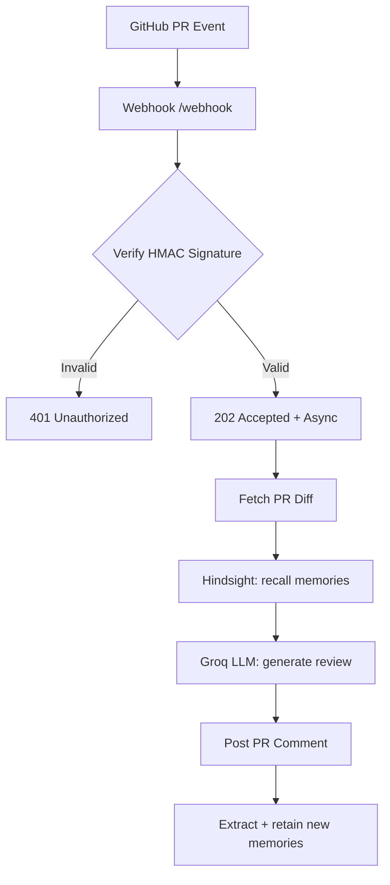

# Code Review Agent with Hindsight Memory

An AI code review agent that remembers your team's decisions, conventions, and past incidents — and gets smarter with every PR.

**Hackathon:** HackwithHyderabad 3.0

## Why Memory Matters
Without memory, an AI reviewer is a generic linter. With [Hindsight](https://github.com/vectorize-io/hindsight), it becomes a long-term team contributor that recalls decisions made weeks ago and flags violations with citations.

## How It Works
1. GitHub sends a `pull_request` webhook (opened/synchronize/reopened) to `POST /webhook`
2. Signature verified (HMAC-SHA256, timing-safe) on the **raw** body
3. PR diff fetched from the GitHub API
4. Relevant team decisions recalled from Hindsight (query = title + changed files + diff excerpt)
5. Groq LLM generates a review with memories injected — citing decisions like "per convention [2]"
6. Review posted as a PR comment
7. New learnings extracted from the review and retained back into Hindsight



## Quick Start

```bash
cp .env.example .env    # fill in real keys
npm install
npm run seed            # optional: seed team conventions
npm run dev             # starts on :8080
```

Forward GitHub webhooks locally (no public URL needed):

```bash
gh extension install cli/gh-webhook
gh webhook forward --repo your-username/code-review-agent --events pull_request > /dev/null
```

## Environment Variables
See [.env.example](.env.example). Required at boot: `GITHUB_TOKEN`, `GITHUB_WEBHOOK_SECRET`, `GROQ_API_KEY`.

## Testing

```bash
npm test          # full suite: security, unit, integration (mock upstreams)
npm run test-webhook  # signed synthetic event against a running server
```

Integration tests run the whole pipeline against local mock GitHub/Groq/Hindsight servers — no network, no keys needed.

## Security
- HMAC-SHA256 signature verification on raw body, timing-safe compare
- Webhook idempotency (delivery-ID dedupe, bounded TTL cache)
- Diff sanitization (fence-breakout / prompt-injection containment, size caps)
- Structured logs with secret redaction; nothing sensitive ever logged
- Payload shape validation before any processing
- Docker: multi-stage, non-root user, health check, graceful SIGTERM shutdown

## Project Structure
```
src/
  index.js     Express app, webhook endpoint, signature verify, graceful shutdown
  config.js    Env config with boot-time validation
  logger.js    Pino structured logging + secret redaction
  github.js    GitHub API client (diff fetch, comment post)
  hindsight.js Hindsight memory client (retain/recall/reflect)
  groq.js      Groq LLM client (review gen, memory extraction)
  prompts.js   Prompt builders + diff sanitization
  memory.js    Learning extraction + retention pipeline
  review.js    Orchestration + idempotency
scripts/       seed-memories, test-webhook
tests/         node:test suite with mock upstreams
```
